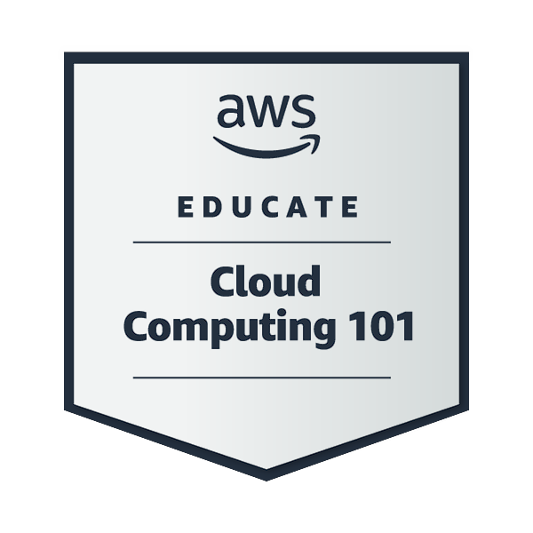

 

 &nbsp; &nbsp;

 
 

  
<b>more Badges 🥇</b>
 
  

   
   
    &nbsp;
    &nbsp;
    &nbsp;
   
   
     
   
   
   
   
   
   
   
   
   
   
   
   
   
                                                         
    
    
     
    
   
   

    
<b>☁️ Google Cloud Badges 🥇</b>
 
    
    
   
    
      
    
    
    
    
  

  

 
 [Verify all Badges : ](https://www.credly.com/users/akashdip2001)

<!--    -->

 

 
 <!--

  

 -->
<h3 src="https://youtu.be/ysBF9EfvWkk?t=428" align="center">National award from Dilhi, award taken from Indian precedent Pronob Mukherjee 2012 , on Drawing</h3> 

 

 

 
 &nbsp;

  &nbsp; 

    &nbsp;  

- 🔭 **curious about my background** [**web-site**](https://akashdip2001.github.io/website-2/) `last update 2021`
- 🌱 works in my college life

  | **DevOps** | **H@cking** [link🔗](https://youtu.be/pWH4i8pVPJk) | **NETWORKING** [link🔗](https://youtu.be/py_eK8z48g8?si=SaZyOFjCLT-MHIYC) |
  | --- | --- | --- |
  | **iOT** [link🔗](https://youtu.be/ySJt3QGyr9w?si=2VsvSz2ms21lVSGX) | **Salesforce** [account-link🔗](https://www.salesforce.com/trailblazer/akashdipmahapatra) | AWS |
---
- 👨‍💻 All of my projects & `achievements` are available at [**Linkedin**](https://www.linkedin.com/in/akashdip2001/)
- 💬 **expert in**

  | Technical | Kali-linux | AWS | Git & Github | [more](https://www.credly.com/users/akashdip2001) |
  | --- | --- | --- | --- | --- |
  | mechanical | SolidWorks | AutoCAD | [more](https://youtube.com/playlist?list=PL_RecMEcs_p__J3GSHkKfLjC08q0NmWtR&si=jdBEFscDwJqhALO5) |
---

 
<b>Connect details</b>
 
 
- 📫 How to reach me **mail.me.akashdip2001@gmail.com**

- 📄 resume `B.Tech 3rd Year` [click](https://drive.google.com/file/d/1M8z8Xg009zNDy1B7-HEkL96HpXB02QkN/view?usp=drivesdk)

- ⚡ Fun fact **Love `Physics` & `Statistics`**

<h2 align="left">Connect with me:</h2>

&nbsp;

#  I am Kali user,
## but,also i know

## using IDE

<!-- final Year Project 2025 -->
 

## WebDev i know

#### Front-end
###  . . .

#### Backend
### 

#### DataBase
###  . . .

| CDN i know | CDN i use |
| :---: | :---: |
|  |   |

#### i use `CDN` to protect my `js` codes

### Deploy website

## Create an Android app, in Google [Play-Store](https://play.google.com/store/apps/details?id=com.akashdipmahapatra.freecad&pcampaignid=web_share) 🔗
#### using_ 

  
   
   
   

## Dev-Ops i know
###  =>  =>  =>  =>  =>  => 

## iOT [source-code 🔗](https://github.com/akashdip2001/ESP32-host-HTML-website/blob/main/README.md) or [full-Video 🔗](https://youtu.be/ySJt3QGyr9w)
### using 

  
  

  
  
 
 

## AI - ML
now i am learning Machine Learning using python

### ML [webSite](https://akashdip2001.github.io/ML-Machine-Learning/)

<!-- <h3> Skills</h3>

  --->
 
 
 

## my Machine Design works,
#### i am a Mechanical Engineering Student (2025), i also love Drawing & design

&nbsp;
&nbsp;
&nbsp;
&nbsp;

 
 

| AutoCAD 2D | AutoCAD 3D | SolidWorks |
| :---: | :---: | :---: |
| [playList likn](https://youtube.com/playlist?list=PL_RecMEcs_p9D9Mw3hr-uLOXioiFdPDGd&si=AOfL6sZVMCxzmtrT) | [all videos](https://youtube.com/playlist?list=PL_RecMEcs_p9NEuljRr7hNsFiPASnJYQt&si=UPFIKc_Rp557CEnz) | [projects](https://youtube.com/playlist?list=PL_RecMEcs_p-rR-kDstljCglAQ4li-RGZ&si=n0Y5dFLoPopeffCx) |

 
 
 

 

 

 

---

<!--
	
 
<b>Badges 2024 🪶</b>
 -->

 &nbsp;

    
 &nbsp;

 

 
    
   
    
      
   
    
    
     

  <!-- 
  
  
  
  
  
  
  
  
  
   --> </a>

<!--
-->

---

	
 
<b>National Award 2012 ☀️</b>
 

---

 &nbsp;

     &nbsp;

# National Award 2012

[Video](https://youtu.be/ysBF9EfvWkk?t=428) 
  
  
[**my web-site**](https://akashdip2001.github.io/linktree/)

---

 
 
 

  
  

<!-- <video width="15%" controls>
  <source src="https://youtu.be/ysBF9EfvWkk?t=428" type="video/mp4">
  Your browser does not support the video tag.
</video> -->

<h4 align="right">last update: 12/08/2024 00:35 AM</h4>
